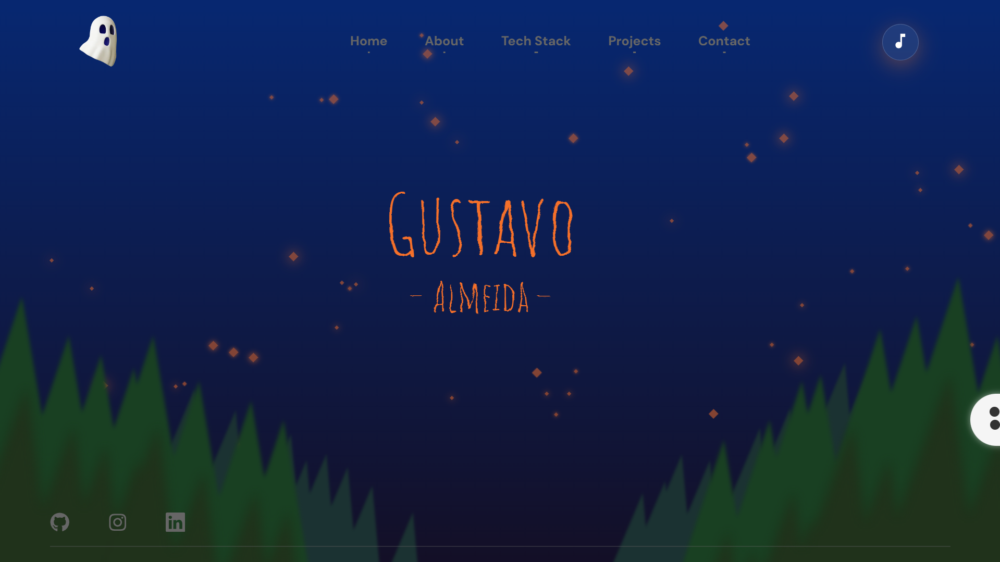

# Spooky blog

> Status : Finished project ✅ / Open PR

## Personal portfolio

_Technologies_

- ReactJS ⚛️
- Styled-components 💅
- React-router-dom 🌐
- Apollo Client 
- Hygraph 
- AOS (Animate On Scroll) 📈
- React-icons 📊
- Atropos 

### How to use

- git clone https://github.com/12Gustavo21/Spooky-blog.git or download the zip
- npm install or yarn install
- code . (if you use VSCode)
- npm start or yarn start

## 💻 Online Page: https://spookyblog.bohr.io

## 📝 Learn more: https://github.com/12Gustavo21/Spooky-blog/wiki

## 🌐 Contact me:

 
